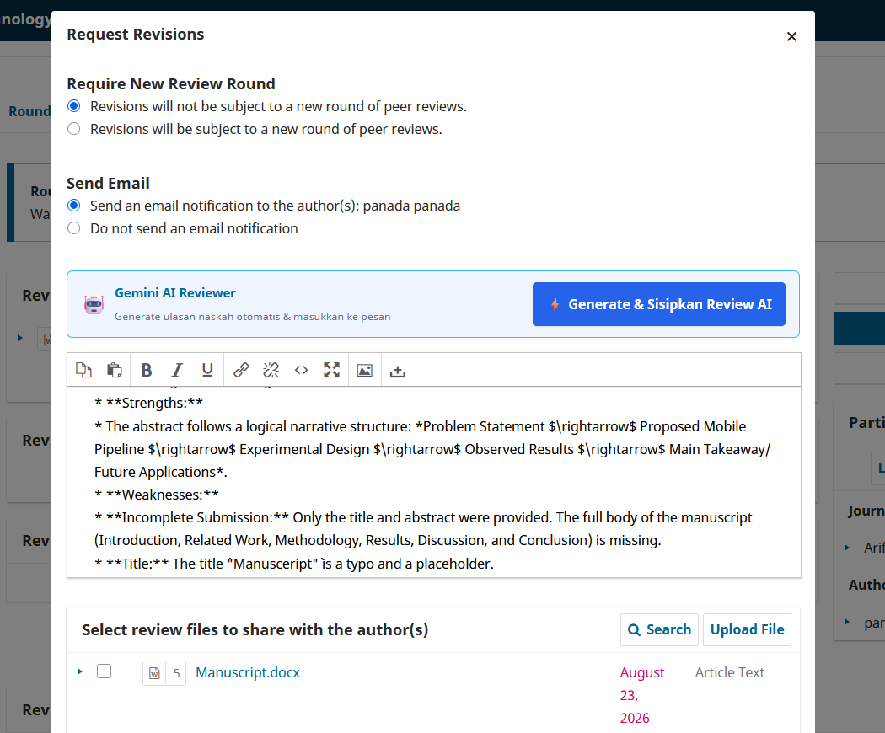

# OJS Gemini AI Manuscript Reviewer

<p align="center">
  
</p>

Integrasi Google Gemini API untuk membantu dewan editor menganalisis naskah secara otomatis pada Open Journal Systems (OJS) 3.3.

---

## 📁 Struktur Berkas

```text
├── plugins/generic/geminiReviewer/
│   ├── GeminiReviewerPlugin.inc.php
│   ├── GeminiReviewerHandler.inc.php
│   ├── index.php
│   └── version.xml
├── lib/pkp/templates/controllers/modals/editorDecision/form/
│   └── sendReviewsForm.tpl
└── .env